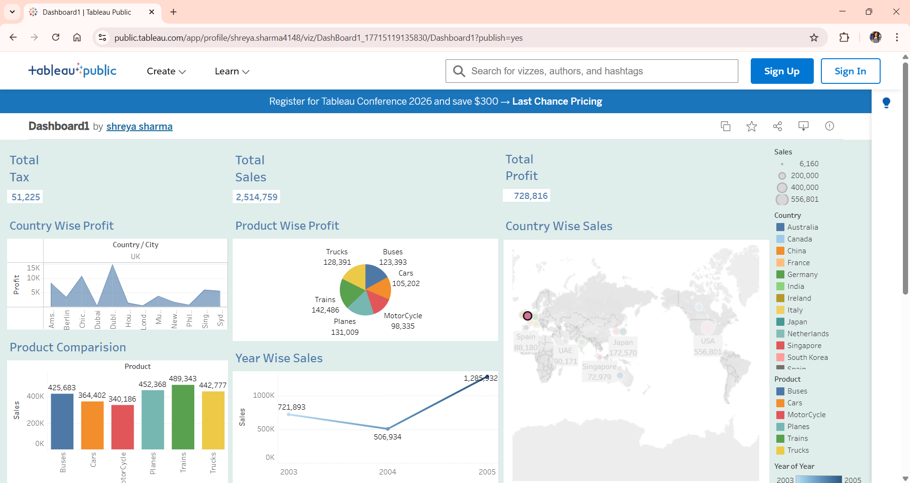

# 🌍 Global Sales Analysis Dashboard

An interactive visualization dashboard built using **Tableau** to analyze global sales performance, profitability trends, tax distributions, and product category breakdowns.

---

## 📸 Dashboard Preview

🔗 **[Live Tableau Dashboard View Here](https://public.tableau.com/app/profile/shreya.sharma4148/viz/DashBoard1_17715119135830/Dashboard1)**

---

## 🔑 Key Insights & Features

* **KPI Metrics:** Tracks Total Sales ($2,514,759), Total Profit ($728,816), and Total Tax ($51,225).
* **Country-Wise Performance:** Visualizes profit metrics across major global cities/countries (e.g., UK, London, Dubai).
* **Product Category Analysis:** Evaluates profitability across vehicle categories (Trucks, Buses, Cars, Motorcycles, Trains, Planes).
* **Sales Trends:** Regional sales and yearly trends distribution map.

---

## 🛠️ Tools & Technologies Used

* **Business Intelligence / Visualization:** Tableau Public
* **Data Source:** Excel / CSV Dataset

---

## 📂 Repository Structure

* `Dashboard.png` - Preview screenshot of the Tableau dashboard.
* `sales_data.xlsx` - Primary dataset used for analysis.
* `README.md` - Documentation of the project.
*
